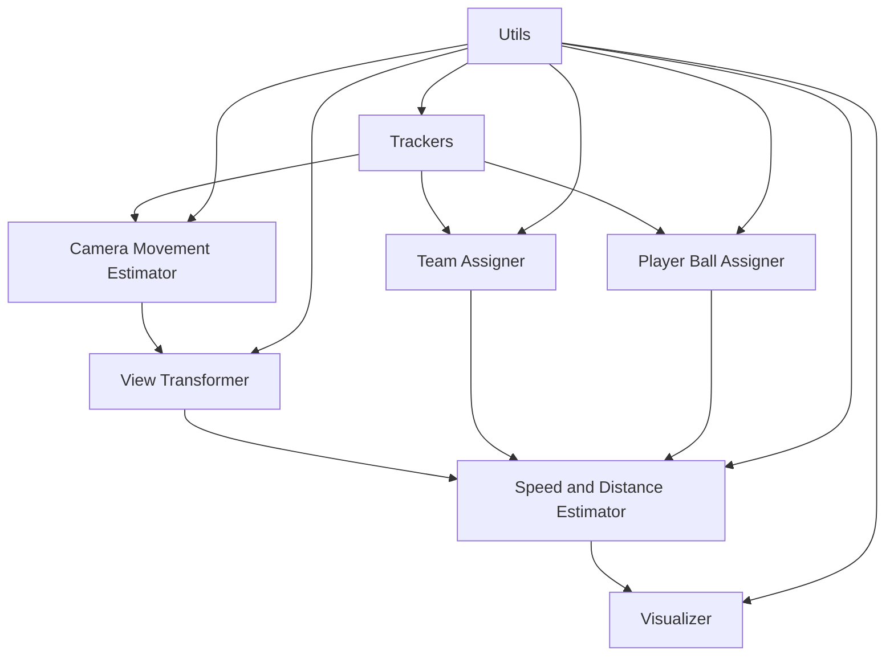

# Module 模块总览

## 项目架构
本项目采用模块化设计，每个模块负责特定的功能，通过清晰的接口进行交互。以下是各个模块的详细说明：

## 模块列表

### 1. [Trackers 模块](./trackers/README.md)
**功能**: 目标检测与跟踪
- **核心算法**: YOLO检测 + ByteTrack跟踪
- **主要功能**: 检测球员、裁判、足球，进行多目标跟踪
- **关键函数**: `get_object_tracks()`, `add_position_to_tracks()`, `interpolate_ball_positions()`

### 2. [Camera Movement Estimator 模块](./camera_movement_estimator/README.md)
**功能**: 相机运动估计
- **核心算法**: 光流法 + 特征点跟踪
- **主要功能**: 估计相机运动，调整目标位置
- **关键函数**: `get_camera_movement()`, `add_adjust_positions_to_tracks()`

### 3. [Team Assigner 模块](./team_assigner/README.md)
**功能**: 球队分配
- **核心算法**: K-means聚类
- **主要功能**: 根据球衣颜色自动分配球员到不同队伍
- **关键函数**: `assign_team_color()`, `get_player_team()`

### 4. [Player Ball Assigner 模块](./player_ball_assigner/README.md)
**功能**: 控球权分配
- **核心算法**: 距离计算 + 最近邻搜索
- **主要功能**: 判断哪个球员拥有控球权
- **关键函数**: `assign_ball_to_player()`

### 5. [Speed and Distance Estimator 模块](./speed_and_distance_estimator/README.md)
**功能**: 运动分析
- **核心算法**: 基于轨迹的速度距离计算
- **主要功能**: 计算球员运动速度和累计距离
- **关键函数**: `add_speed_and_distance_to_tracks()`, `draw_speed_and_distance()`

### 6. [View Transformer 模块](./view_transformer/README.md)
**功能**: 视角变换
- **核心算法**: 透视变换 + 关键点检测
- **主要功能**: 将像素坐标转换为真实场地坐标
- **关键函数**: `transform_point()`, `add_transformed_position_to_tracks()`

### 7. [Utils 模块](./utils/README.md)
**功能**: 工具函数
- **核心算法**: 基础几何计算
- **主要功能**: 边界框处理、距离计算、视频读写
- **关键函数**: `get_center_of_bbox()`, `measure_distance()`, `read_video()`

### 8. [Visualizer 模块](./visualizer/README.md)
**功能**: 数据可视化
- **核心算法**: matplotlib图表绘制
- **主要功能**: 生成控球率、运动分析等统计图表
- **关键函数**: `plot_team_ball_control()`, `plot_players_speed_distance()`

## 数据流图

```
输入视频
    ↓
Trackers (目标检测与跟踪)
    ↓
Camera Movement Estimator (相机运动估计)
    ↓
View Transformer (视角变换)
    ↓
Team Assigner (球队分配)
    ↓
Player Ball Assigner (控球权分配)
    ↓
Speed and Distance Estimator (运动分析)
    ↓
Visualizer (数据可视化)
    ↓
输出结果
```

## 模块依赖关系



## 核心数据结构

### 轨迹数据结构
```python
tracks = {
    "players": [
        {
            track_id: {
                "bbox": [x1, y1, x2, y2],
                "position": (x, y),
                "position_adjusted": (x, y),
                "position_transformed": (x, y),
                "team": 1/2,
                "team_color": (B, G, R),
                "has_ball": True/False,
                "speed": float,
                "distance": float
            }
        }
    ],
    "referees": [...],
    "ball": [...]
}
```

## 使用流程

### 1. 初始化阶段
```python
# 读取视频
video_frames = read_video('input.mp4')

# 初始化跟踪器
tracker = Tracker('models/yolo/best.pt')
```

### 2. 检测与跟踪阶段
```python
# 获取跟踪结果
tracks = tracker.get_object_tracks(video_frames)

# 添加位置信息
tracker.add_position_to_tracks(tracks)
```

### 3. 运动估计阶段
```python
# 相机运动估计
camera_estimator = CameraMovementEstimator(video_frames[0])
camera_movement = camera_estimator.get_camera_movement(video_frames)
camera_estimator.add_adjust_positions_to_tracks(tracks, camera_movement)
```

### 4. 视角变换阶段
```python
# 透视变换
view_transformer = ViewTransformer()
view_transformer.add_transformed_position_to_tracks(tracks)
```

### 5. 队伍分配阶段
```python
# 球队分配
team_assigner = TeamAssigner()
team_assigner.assign_team_color(video_frames[0], tracks['players'][0])

# 为每帧分配队伍
for frame_num, player_track in enumerate(tracks['players']):
    for player_id, track in player_track.items():
        team = team_assigner.get_player_team(video_frames[frame_num], track['bbox'], player_id)
        tracks['players'][frame_num][player_id]['team'] = team
```

### 6. 控球权分析阶段
```python
# 控球权分配
player_assigner = PlayerBallAssigner()
for frame_num, player_track in enumerate(tracks['players']):
    ball_bbox = tracks['ball'][frame_num][1]['bbox']
    assigned_player = player_assigner.assign_ball_to_player(player_track, ball_bbox)
    if assigned_player != -1:
        tracks['players'][frame_num][assigned_player]['has_ball'] = True
```

### 7. 运动分析阶段
```python
# 速度和距离计算
speed_estimator = SpeedAndDistance_Estimator()
speed_estimator.add_speed_and_distance_to_tracks(tracks)
```

### 8. 可视化阶段
```python
# 生成统计图表
plot_team_ball_control(team_ball_control, save_dir="figures")
plot_players_speed_distance(tracks, save_dir="figures")
plot_players_speed_distance_by_team(tracks, save_dir="figures")
```

## 性能优化建议

### 1. 缓存机制
- 支持轨迹数据的保存和读取
- 支持相机运动数据的缓存
- 避免重复计算

### 2. 批量处理
- 视频帧批量处理
- 目标检测批量推理
- 数据可视化批量生成

### 3. 内存管理
- 及时释放大对象
- 使用生成器处理大视频
- 优化数据结构

### 4. 并行处理
- 多线程处理视频帧
- GPU加速深度学习推理
- 并行化数据可视化

## 扩展建议

### 1. 新功能模块
- 战术分析模块
- 球员表现评估模块
- 实时分析模块

### 2. 算法优化
- 更精确的目标检测
- 更稳定的跟踪算法
- 更智能的队伍分配

### 3. 可视化增强
- 交互式图表
- 3D可视化
- 实时数据展示

## 依赖项总览

- **深度学习**: ultralytics, supervision
- **图像处理**: opencv-python
- **数值计算**: numpy, pandas
- **机器学习**: scikit-learn
- **可视化**: matplotlib
- **标准库**: os, pickle, sys

## 开发指南

### 1. 代码规范
- 遵循PEP 8编码规范
- 添加详细的函数文档
- 使用类型提示

### 2. 测试策略
- 单元测试覆盖核心函数
- 集成测试验证模块交互
- 性能测试评估处理速度

### 3. 文档维护
- 及时更新README文档
- 记录算法变更
- 提供使用示例
